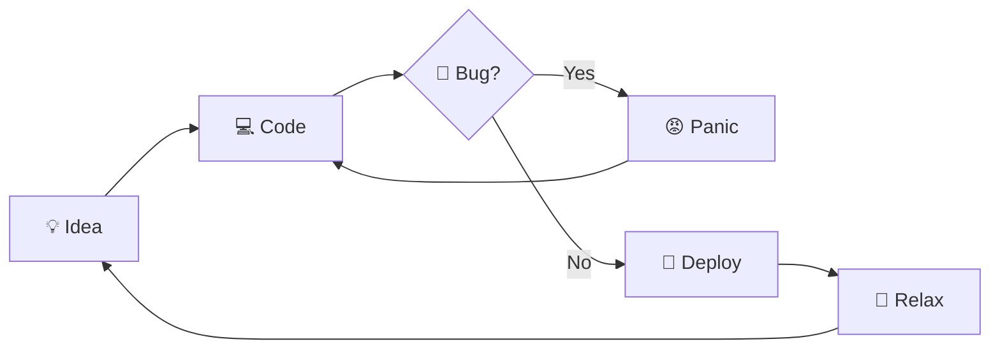

<div align="center">
  <style>
    @keyframes shift {
      0%   { background-position: 0% 50%; }
      50%  { background-position: 100% 50%; }
      100% { background-position: 0% 50%; }
    }
    .gradient {
      background: linear-gradient(270deg, #ff6b6b, #ffd93d, #6bcb77, #4d96ff, #c678dd);
      background-size: 400% 400%;
      -webkit-background-clip: text;
      background-clip: text;
      -webkit-text-fill-color: transparent;
      color: transparent;
      animation: shift 8s ease infinite;
      font-weight: 800;
    }
  </style>
</div>

<div align="center">
  
</div>

<h1 align="center">I'm <span class="gradient">Lenny</span> ✨</h1>

<h3 align="center">Code · Learn · Deploy · Repeat</h3>

<p align="center">
  
  
  
</p>

<br />

<hr />

## 🧑‍💻 About Me

<div align="center">
  <table>
    <tbody>
      <tr>
        <td>✨</td>
        <td>Creating bugs since <b>2022</b></td>
      </tr>
      <tr>
        <td>🔭</td>
        <td>Currently working on <b>a lot of things</b> 👨‍💻</td>
      </tr>
      <tr>
        <td>🌱</td>
        <td>Currently learning <b>everything</b> 🤓</td>
      </tr>
      <tr>
        <td>🔒</td>
        <td>The most interesting projects are <b>private</b></td>
      </tr>
      <tr>
        <td>📫</td>
        <td>Reach me on Discord or Instagram</td>
      </tr>
    </tbody>
  </table>
</div>

<div align="center">
  <a href="https://discordapp.com/users/1001158048276033536" target="_blank">
    
  </a>
  <a href="https://www.instagram.com/lenny.ts_" target="_blank">
    
  </a>
</div>

<br />

<hr />

## 🍀 If I were a function...

```python
def lenny():
    """A passionate software developer from Italy 🍝"""
    languages = ["Python", "Go", "TypeScript", "Java", "C"]
    vibes = ["coding", "learning", "getting high 💨"]
    projects = ["a lot of things"]

    for vibe in vibes:
        while bug_found:
            refactor(create_feature_not_bug())
        if motivation_low:
            roll_joint()
            get_back_to_work()
        code(random.choice(projects))
        learn(random.choice(languages))
```

<br />

<hr />

## 🔄 DevLife Pipeline



<br />

<hr />

## ⚒️ Languages · Frameworks · Tools

### 🌐 Languages
<div align="center">
  
</div>

### ⚙️ Frameworks & Libraries
<div align="center">
  
</div>

### 🛠️ Tools & IDEs
<div align="center">
  
</div>

### 💾 Databases
<div align="center">
  
</div>

### 🖥️ Operating Systems
<div align="center">
  
</div>

<br />

<hr />

## 📦 Deploy Journal

<!-- DEPLOY_JOURNAL_START -->

| Project | Version | Date | Notes |
|:---|---:|---:|:---|
| [league_profile_tool](https://github.com/lenny-ts/league_profile_tool/releases/tag/v1.12.0) | v1.12.0 | 2026-08-10 | `League Profile Tool v1.12.0` |
| [caddy-analyzer](https://github.com/lenny-ts/caddy-analyzer/releases/tag/v0.3.0) | v0.3.0 | 2026-08-06 | `v0.3.0` |
| [Spotify-Playlist-Reader](https://github.com/lenny-ts/Spotify-Playlist-Reader/releases/tag/1.3) | 1.3 | 2024-09-24 | `1.3` |

<!-- DEPLOY_JOURNAL_END -->

<br />

<hr />

## 🐍 My Contributions

<div align="center">
  <picture>
    <source media="(prefers-color-scheme: dark)" srcset="https://raw.githubusercontent.com/lenny-ts/lenny-ts/output/github-contribution-grid-snake-dark.svg" />
    
  </picture>
</div>

<br />

<hr />

## ⚡ GitHub Stats

<div align="center">
  
  
</div>

<div align="center">
  
  
</div>

<div align="center">
  
</div>

<div align="center">
  
</div>

<br />

<hr />

<div align="center">
  <h2>💖 Support Me</h2>
  <a href='https://ko-fi.com/profumato' target='_blank'></a>
</div>

<br />

<p align="center">
  <i>⚡ Always building, always learning, always vibing.</i>
</p>